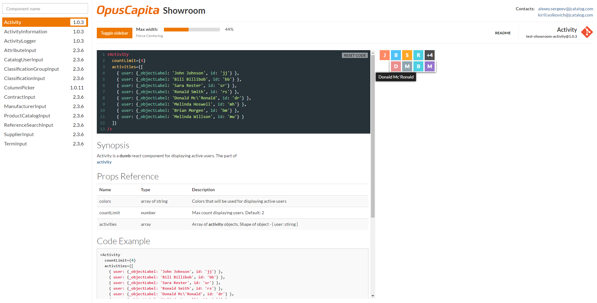

# Showroom

## Synopsis

React based components catalog which provide a **documentation** and **live examples**.

## Motivation to develop

* Easilly browsing with examples to pick the most appropriate component for your current task
* Provide an **always actual documentation**

## Usage

### [Embedded](./docs/embedded.md)

* Developer-side variant
* **Always write** the documentation :pencil:
* Take care about other developers and others take care about you :tophat:

### [Server application](./docs/server.md)

* Browse components catalog
* See usage code examples
* See **API** documentation
* Change component properties and see whan happenned **in realtime**
* Change component **version** to see appropriate documentation

## Contacts:

* Alexey Sergeev - [alexey.sergeev@jcatalog.com](alexey.sergeev@jcatalog.com)
* Kirill Volkovich - [kirill.volkovich@jcatalog.com](kirill.volkovich@jcatalog.com)

## License

OpusCapita 2016
